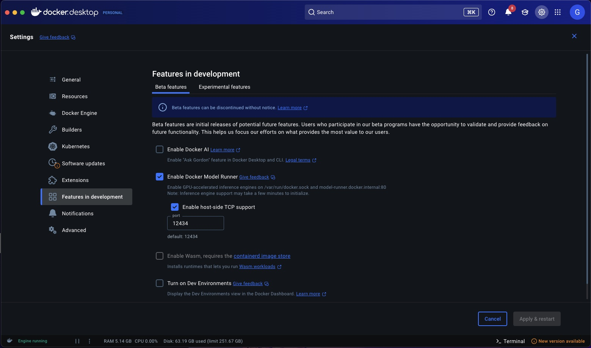

# AI Ready Content in ACS - CommunityLive25

### Class Pre-requisits
1. Java 21 & Maven 3.9+ (for local builds)
   - Install Java with Brew:
   ```
    brew install java   #installs java
    java -version       #check java version (confirm install)
   ```
   - Install Maven with Brew: [Brew Maven Install](https://formulae.brew.sh/formula/maven)
2. Docker Desktop: [Docker Desktop](https://www.docker.com/get-started/)
   - Ensure you have the correct Docker Model Runner settings in Docker Desktop application; see below:
   - 
3. An Ollama daemon exposing llava LLM on ```http://localhost:11434```
Install Ollama by downloading the relevant install for your OS [HERE](https://ollama.com/download/mac)
   - In Terminal:
```
ollama pull llava    #install ollama
ollama pull mistral  #install mistral
```
4. HTTPie or equivalent HTTP Request application you're familiar with (i.e.: Postman, etc)
   - [HTTPie](https://httpie.io/download)


 